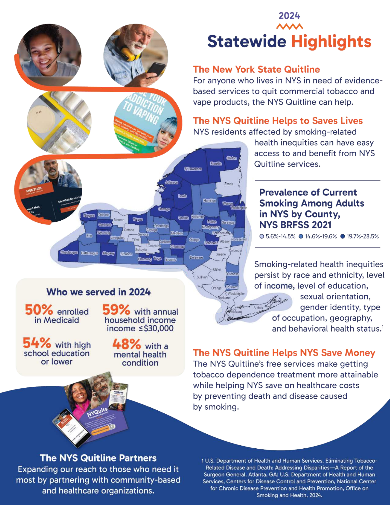

```{python}
#| echo: false
#| warning: false
#| message: false
import sys
from pathlib import Path

# Ensure root-level modules (scripts/) are importable in both Quarto run contexts.
cwd = Path.cwd()
project_root = cwd if (cwd / "scripts").exists() else cwd.parent
if str(project_root) not in sys.path:
    sys.path.insert(0, str(project_root))

CHA_WORKBOOK_PATH = (
    project_root / "data" / "raw" / "Mid-Hudson Regional Community Health Assessment 2025 Data File.xlsx"
)
if not CHA_WORKBOOK_PATH.exists():
    CHA_WORKBOOK_PATH = Path(
        "/Users/dq/Coding/Coding Projects/Mid-Hudson Regional CHA 2025/"
        "Mid-HudsonRegionalCHA-2025/data/raw/"
        "Mid-Hudson Regional Community Health Assessment 2025 Data File.xlsx"
    )
```

## Mental Health

Health is an all-encompassing term that involves not only physical well-being but also mental wellness. The World Health Organization (WHO) defines health as a "state of complete physical, mental, and social well-being, and not merely the absence of disease or infirmity" [@who-constitution-2025]. There are many factors that contribute to a person's mental health, including daily habits, traumatic life events, family history of mental illness, and substance use. Almost one in five young people in the U.S. are affected by some type of mental, emotional, or behavioral disorder (MEB), such as depression or substance use [@nysdoh-prevention-agenda-wellbeing-2020]. Poor mental health can affect all aspects of an individual's life, including family, school, and work. It is a major economic burden in the U.S., costing $193.2 billion in lost earnings annually due to serious mental illness [@nami-mental-health-statistics-2025]. Mental and physical health are closely connected, and it is therefore important to address mental health issues in the community.

In 2021, the percentage of adults who reported poor mental health for 14 or more days was highest in Putnam, Sullivan, and Ulster Counties (17.4%, 16.3%, and 15.7%, respectively), while the lowest percentage was in Rockland County (9.4%). The M-H Region as a whole was lower than NYS (10.4% vs 13.4%, respectively). From 2016 to 2021, the percentage increased in most counties, with the exception of Dutchess and Orange.


```{python}
#| echo: false
#| warning: false
#| message: false
# Suppress auto-generated table source callouts in this chapter;
# manual source callouts in markdown are kept as authored.
from scripts import cha_registry_renderer as _cha_registry_renderer

_cha_registry_renderer.render_source_callout_for_object = lambda *args, **kwargs: ""
```

<!--Figure 166: "Percentage of Adults with Poor Mental Health for 14 or More Days in the Last Month, 2016, 2018, and 2021"-->




::: {.callout-note collapse="true"}
## Source

NYSDOH Behavioral Risk Factor Surveillance System, May 2025
https://www.health.ny.gov/statistics/brfss/expanded/
:::

::: {.callout-note} 
Note: The percentage is age-adjusted. An adult is a person aged 18 years or older. The Behavioral Risk Factor Surveillance System asks respondents, "Now thinking about your mental health, which includes stress, depression, and problems with emotions, for how many days during the past 30 days was your mental health not good?" Based on responses to this question, BRFSS defines "poor mental health" as an adult over the age of 18 reporting 14 or more days to this question.
:::

One major disorder that can lead to poor mental health is depression. Depression is a mood disorder that causes a constant feeling of sadness or lack of interest in usual life activities. In 2021, the highest percentage of people reporting a depressive disorder was in Ulster County (24.1%), and the lowest was in Westchester County (12.4%) [see Figure 167]. From 2016 to 2021, the percentage of people reporting a depressive disorder increased in all counties, the M-H Region, and NYS.

<!--Figure 167: "Percentage of Adults Reporting a Depressive Disorder, 2016, 2018, and 2021"-->




::: {.callout-note collapse="true"}
## Source

NYSDOH Behavioral Risk Factor Surveillance System, May 2025
https://www.health.ny.gov/statistics/brfss/expanded/
:::

::: {.callout-note}
Note: The percentage is age-adjusted. An adult is a person aged 18 years or older. The Behavioral Risk Factor Surveillance System asks
respondents, "Have you ever been told you had a depressive disorder (including depression, major depression, dysthymia, or minor
depression)?"
:::

## Substance Use

Substance use refers to the recurrent use of substances, such as nicotine, alcohol, and/or opioids. Drug addiction, also called substance use disorder, can affect a person's brain and behavior and interfere with responsibilities at school, work, or home. It is linked to many health problems, and overdoses can lead to hospital visits or death [@hp2030-drug-and-alcohol-use-2025]. According to the 2023 National Survey on Drug Use and Health (NSDUH), 48.5 million people aged 12 years or older (or 17.1% of this population) had a substance use disorder in the past year, including 28.9 million who had alcohol use disorder and 27.2 million who had a drug use disorder [@samhsa-nsduh-key-indicators-2023].

### Tobacco & Vaping
Tobacco use leads to diseases that harm almost every organ in the body. Smoking is the leading cause of preventable death in the U.S., and in 2018 smoking-related illness cost an estimated more than $600 billion in direct medical care and lost productivity [@cdc-tobacco-economic-trends-2024]. Tobacco contains nicotine, a chemical substance that can lead to addiction. More than 16 million Americans are living with a disease caused by smoking, including cancer (specifically lung cancer), heart disease, stroke, diabetes, and COPD [@cdc-tobacco-about-2024]. [@tbl-smoke-risk] shows the increased risk that smoking can have on the incidence and mortality of certain diseases.

<!--Table 20: "Increased Risk of Disease Incidence from Smoking, 2021"-->



Tobacco use can also have disproportionate effects on diverse populations. For example, the Medicaid population has a higher prevalence of smoking and has a harder time quitting. African Americans are more likely to die from smoking-related disease. People with mental health conditions are four times more likely to die from smoking. People experiencing disability also have a higher prevalence of smoking. Figure 168 shows the percentage of New York State Smokers Quitline users from the Metro Region, which includes the seven M-H Region counties, who fell into these diverse categories.

{#fig-nys-smokefree-statewide-highlights fig-alt="2024 NYS Smokers Quitline statewide highlights graphic" width="100%"}

From 2016 to 2021, the percentage of adults who smoked cigarettes decreased in almost every county in the M-H Region, with the exception of Dutchess and Rockland Counties, NYS, and NYS excluding NYC. In 2021, Dutchess County had the highest percentage of adults who smoked cigarettes and Westchester County had the lowest percentage (17.4% and 6.3%, respectively). The Healthy People 2030 goal is to reduce cigarette smoking among adults to 6.1% [@hp2030-reduce-adult-cigarette-smoking-tu-02-2025]. [@fig-adult-currsmoke-percent]

Figure 169 Percentage of Adults Who Are Current Smokers, 2016, 2018, and 2021

<!--Figure 169: "Percentage of Adults Who Are Current Smokers, 2016, 2018, and 2021"-->


::: {.callout-note} 
*: Percentage is unreliable due to large standard error.
Note: The percentage is age-adjusted. An adult is a person aged 18 years or older. The Behavioral Risk Factor Surveillance System asks respondents, "Have you smoked at least 100 cigarettes in your entire life?" and "How long has it been since you last smoked a cigarette, even one or two puffs?" Based on responses to both questions, BRFSS defines “current smoker” as an adult over the age of 18 who has smoked at least 100 cigarettes in their lifetime and currently smokes on at least some days.
:::

Although tobacco use appears to be decreasing over time, the use of electronic nicotine delivery systems (ENDS), or vaping, has become widely popular over the past few years. Electronic nicotine delivery systems (electronic cigarettes or e-cigarettes, vaping pens, hookah pens, etc.) were originally created to provide alternative products for people trying to quit smoking cigarettes. Although use became a trend among young adults, according to the NYSDOH, e-cigarette use among high school youth appears to have peaked in 2018 at 27.4% and declined to 18.7% in 2022. Similarly, use of any tobacco product among high school students, including ENDS, has decreased since 2018 from 30.6% to 20.8% in 2022 and has reached the lowest youth smoking rate on record.
[@nysdoh-youth-tobacco-statshot-2023] 

For more information, please visit the CDC's Electronic Cigarette page [@cdc-e-cigarettes-2025].

For more information on how to quit smoking, call 1-866-NY-QUITS or visit https://nysmokefree.com/.


### Alcohol
Excessive alcohol use has led to more than 170,000 deaths and about 4 million years of potential life lost each year in the U.S. from 2020 to 2021 [@cdc-alcohol-factsstats-2024]. Binge drinking, defined as when women have four or more drinks or men have five or more drinks on one occasion, is the most common pattern of excessive alcohol use [@cdc-about-alcohol-use-2025]. Among adults in the United States, 17% binge drink [@cdc-excessive-drinking-data-2024].

Binge drinking decreased in almost all counties in the M-H Region from 2016 to 2021, with the exception of Rockland and Sullivan Counties. Putnam County had the highest percentage of adults binge drinking in 2021 at 18.7%, and Rockland County had the lowest percentage at 12.2% [@fig-adult-bingedrink-percent].

<!--Figure 170: "Percentage of Adults Binge Drinking During the Past Month, 2016, 2018, and 2021"-->




::: {.callout-note collapse="true"}
## Source

NYSDOH Behavioral Risk Factor Surveillance System, May 2025 https://www.health.ny.gov/statistics/brfss/expanded/
:::

::: {.callout-note}
Note: The percentage is age-adjusted. An adult is a person aged 18 years or older. The Behavioral Risk Factor Surveillance System asks respondents, "Considering all types of alcoholic beverages, how many times during the past 30 days did you have (for men) 5 or more drinks on an occasion or (for women) 4 or more drinks on an occasion?" Based on the responses to this question “binge drinking” is defined as consuming 4 or more drinks for women and 5 or more drinks for men on a single occasion.
:::

Binge drinking can lead to many different health and social problems, including unintentional motor vehicle accidents. In 2023, 30% of traffic-related deaths in the U.S. were due to alcohol-impaired driving [@nhtsa-alcohol-impaired-driving-2025]. For regional data regarding alcohol-related motor vehicle injuries and deaths, refer to the Motor Vehicle Accidents section.

### Opioid Use

Opioids are a class of drugs that include illicit drugs such as heroin, synthetic opioids such as fentanyl, and prescription pain relievers such as oxycodone, hydrocodone, and morphine. According to the CDC, in 2023 about 76% of drug overdoses involved an opioid, and deaths involving multiple drugs also increased [@cdc-overdose-prevention-about-2025]. The financial costs of management, treatment, and lost productivity due to misuse of illicit drugs, prescription drugs, and alcohol were estimated at $442 billion in 2012 [@nysdoh-prevention-agenda-wellbeing-2020].

From 2019 to 2020, ED visit rates for overdoses involving any opioid increased in almost all seven counties in the M-H Region except Westchester. Since 2020, rates have fallen or remained relatively stable in all seven counties in the M-H Region, as well as in NYS and NYS excluding NYC [@fig-ed-visit-opioid-aar].

<!--Figure 171: "All Emergency Department Visits Involving Any Opioid Overdose, Age-Adjusted Rate per 100,000 Population, 2019–2022"-->




::: {.callout-note}
Note: Includes outpatient and admitted patient visits to the emergency department involving any opioid poisoning as the principal diagnosis
or first-listed cause of injury.
:::

Hospital discharges involving any opioid overdose have generally remained stable over time, with the exception of Sullivan County, which saw a large rate increase in 2020 before rates began to decrease [@fig-hospital-dc-opioid-aar].

<!--Figure 172: "Hospital Discharges Involving Any Opioid Overdose, Age-Adjusted Rate per 100,000 Population, 2019–2022"-->




::: {.callout-note}
*: The rate is unstable.
Note: Y-axis does not begin at zero in order to clearly display trend lines. Includes hospital discharges involving any opioid poisoning,
principal diagnosis or first-listed cause of injury.
:::

Substance use treatment is intended to help people address problems associated with their use of alcohol or drugs, including related medical problems. Data on who actually seeks help can indicate whether interventions are effectively reaching those in need. In 2019, about 21.6 million people needed substance use treatment, but only 2.6 million received it. Despite increased awareness of the opioid epidemic, as well as laws and regulations that expanded treatment coverage, there has been no consistent upward trend in people seeking and accessing treatment [@addiction-group-addiction-statistics-2025].
This flattened trend is evident in the M-H Region, where in most counties the number of individuals enrolled in OASAS-certified substance use disorder programs has remained relatively level [@fig-treat-prog-opioid-crude].

<!--Figure 173: "Individuals Enrolled in Treatment Programs Reporting Any Opioid as a Primary Substance, Crude Rate per 100,000 Population, 2020–2023"-->




::: {.callout-note}
Note: This indicator includes people who were admitted to an OASAS-certified substance use disorder treatment program. A person is counted once if they were in treatment (received one or more services) during the calendar year. A unique person may receive multiple services or be in treatment for many years and, therefore, may be counted uniquely across one or more calendar years. Totals cannot be summed across years/rows because they are not mutually exclusive. The most recent data collected for the year of enrollment was used to determine the person's county of residence during the reported year. Any opioid use includes heroin use.
:::

From 2019 to 2022, the rate of overdose deaths involving any opioid steadily increased across most counties in the M-H Region, as well as in NYS and NYS excluding NYC. In 2022, the highest rate was in Sullivan County and the lowest rate was in Rockland County (61.5 and 12.9 per 100,000 population, respectively) [@fig-OD-anyopioid-crude].

<!--Figure 174: "Overdose Deaths Involving Any Opioid, Crude Rate per 100,000 Population, 2019–2022 "-->




::: {.callout-note}
*: The rate is unstable.
Note: Includes poisoning deaths involving any opioid, all manners, using all causes of death.
:::

[@fig-OD-multiple-opioid-aar] shows the rate of overdose deaths in 2022 stratified by the type of opioid used. The highest rate of overdose deaths in all counties was caused by opioid pain relievers. Synthetic opioids other than methadone were a close second.

<!--Figure 175: "Overdose Deaths Involving Opioid Pain Relievers, Heroin, and Synthetic
Opioids Other than Methadone, Age-Adjusted Rate per 100,000 Population,
2022"-->




::: {.callout-note}
*: The rate is unstable.
Note: Includes poisoning deaths involving any opioid pain relievers (including illicitly produced opioids such as fentanyl), heroin, and synthetic opioids other than methadone, all manners, using all causes of death.
:::

When overdose deaths are stratified by age, the rate of overdose death was higher in most counties among adults aged 45 to 64 years compared with those aged 18 to 44 years across all three types of overdose deaths (any opioid, heroin, and opioid pain relievers) [@fig-18to64-anyop-od-crude - @fig-18to64-opioid-pain-crude]. This shows a shift from previous years, when overdose deaths were predominantly among adults aged 18 to 44 years. Sullivan County had the highest overdose death rates among adults aged 18 to 44 years caused by all three types (99.9, 11.5, and 99.9 per 100,000 population, respectively), as well as among adults aged 45 to 64 years (89.3, 23.5, and 89.3 per 100,000 population, respectively).

<!--Figure 176: "Overdose Deaths among Adults Involving Any Opioid, Crude Rate per 100,000 Population, 2022"-->




::: {.callout-note}
Note: This includes adults aged 18–64 years old. Includes all poisoning deaths involving opioids, all manners, using all causes of death.
:::

<!--Figure 177: "Overdose Deaths among Adults Involving Heroin,
Crude Rate per 100,000 Population, 2022"-->




::: {.callout-note}
*: The rate is unstable.
Note: This includes adults aged 18–64 years old. Poisoning deaths involving heroin, all manners, using all causes of death.
:::

<!--Figure 178: "Overdose Deaths among Adults Involving Opioid Pain Relievers,
Crude Rate per 100,000 Population, 2022"-->




::: {.callout-note}
*: The rate is unstable.
Note: This includes adults aged 18–64 years old. Includes poisoning deaths involving opioid pain relievers (including illicitly produced opioids such as fentanyl), all manners, using all causes of death.
:::

There are many efforts being made at the federal, state, and local levels to combat the opioid epidemic. Methods include improving opioid prescribing practices; increasing education, training, and distribution of naloxone (an overdose reversal drug); and increasing access to medication-assisted treatment [@nida-prescription-drug-abuse-heroin-introduction-2018].

From 2020 to 2023, prescription rates for opioid analgesics (pain relievers) decreased across each county in the M-H Region, as well as in NYS and NYS excluding NYC. In 2023, Sullivan County had the highest opioid analgesic prescription rate and Westchester County had the lowest rate (352.7 and 162.9 per 1,000 population, respectively) [@fig-opioid-analgesic-rx-aar].

<!--Figure 179: "Opioid Analgesics Prescriptions, Age-Adjusted Rate per 1,000 Population, 2020–2023"-->




::: {.callout-note}
Note: Includes Schedule II (Drugs with some medically acceptable uses, but with high potential for abuse and/or addiction. These drugs can be obtained through prescription.), III (Drugs with low to moderate potential for abuse and/or addiction, but less dangerous than Schedule I or II. These drugs can be obtained through prescription but generally are not available over the counter.), and IV (Drugs with viable medical use and low probability of use or misuse.) opioid analgesic prescriptions dispensed to state residents.
:::

Buprenorphine is an opioid used to treat opioid addiction. It is a medication that can be prescribed in physician offices, thereby increasing access to treatment. It can produce effects such as euphoria and respiratory depression, but these effects are much weaker than those of other opioids such as heroin [@samhsa-buprenorphine-2024]. From 2020 to 2023, the rate of patients who received at least one buprenorphine prescription for opioid use disorder generally increased across each county and NYS [see Figure 180]. In 2023, Sullivan County had the highest buprenorphine prescription rate and Westchester County had the lowest rate (1529.8 and 215.3 per 100,000 population, respectively).

<!--Figure 180: "Patients Who Received at Least One Buprenorphine Prescription for
Opioid Use Disorder, Age-Adjusted Rate per 100,000 Population, 2020–2023"-->




::: {.callout-note}
Note: Patients Who Received at Least One Buprenorphine Prescription for Opioid Use Disorder, Age-Adjusted Rate per 100,000 Population, 2020–2023
:::


## Suicide
Suicide is a serious public health problem that can have lasting harmful effects on individuals, families, and communities. It is associated with several risk factors, including experiences of bullying, sexual violence, and child abuse. In 2023, 12.8 million American adults considered attempting suicide, and over 49,000 died by suicide [@cdc-suicide-about-2025]. Protective factors, such as connectedness with family and friends and access to health care services, can help prevent suicide.

Healthy People 2030 set a goal to reduce suicide rates to 12.8 suicides per 100,000 population. Four counties met this target, with three exceptions (Dutchess, Sullivan, and Ulster) [see Figure 181]. Suicide among young people is also a public health concern, especially in Ulster County, where the suicide mortality rate among teenagers aged 15 to 19 years was 12.0 per 100,000 population, though this rate is unstable.


<!--Figure 181: "Suicide Mortality, Crude Rate per 100,000 Total Population
Compared to Those 15–19 Years Old, 2020–2022
-->




::: {.callout-note}
*: The rate is unstable.
Note: Three-year averages are used for counties and single-year rates are used for Mid-Hudson, NYS, and NYS excluding NYC. The ICD-10 codes used for suicide are: X60-X84, Y87.0.
:::

Suicide mortality rates remained relatively flat for a few counties and NYS from 2018 to 2021, while increases were seen between 2020 and 2021 for Putnam, Westchester, and Dutchess. Rockland County showed a steady decrease in suicide rate since 2018 [@fig-suicide-mortal-aar].

<!--Figure 182: "Suicide Mortality, Age-Adjusted Rate per 100,000 Population, 2018–2021"-->




::: {.callout-note}
Note: Y-axis does not begin at zero in order to clearly display trend lines. Three-year averages are used for counties and single-year rates
are used for NYS and NYS excluding NYC. The ICD-10 codes used for suicide are: X60-X84, Y87.0.
:::

