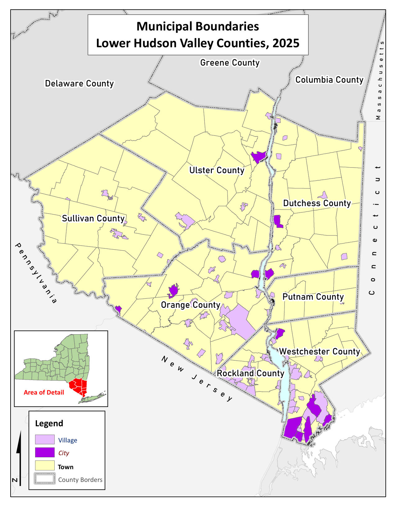
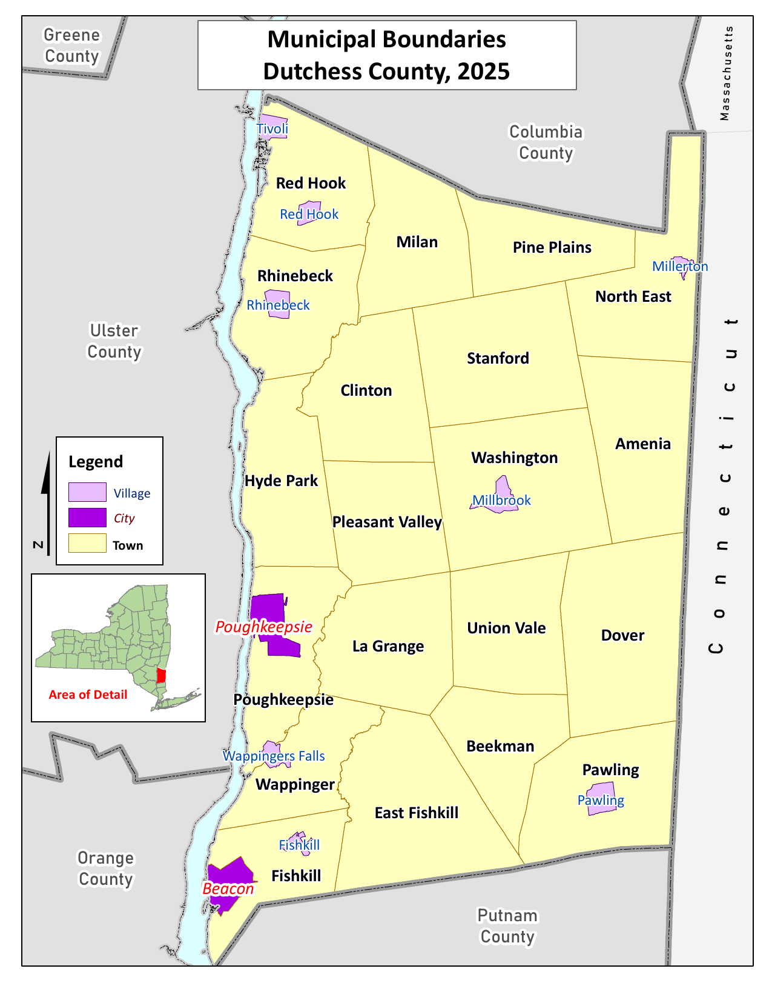
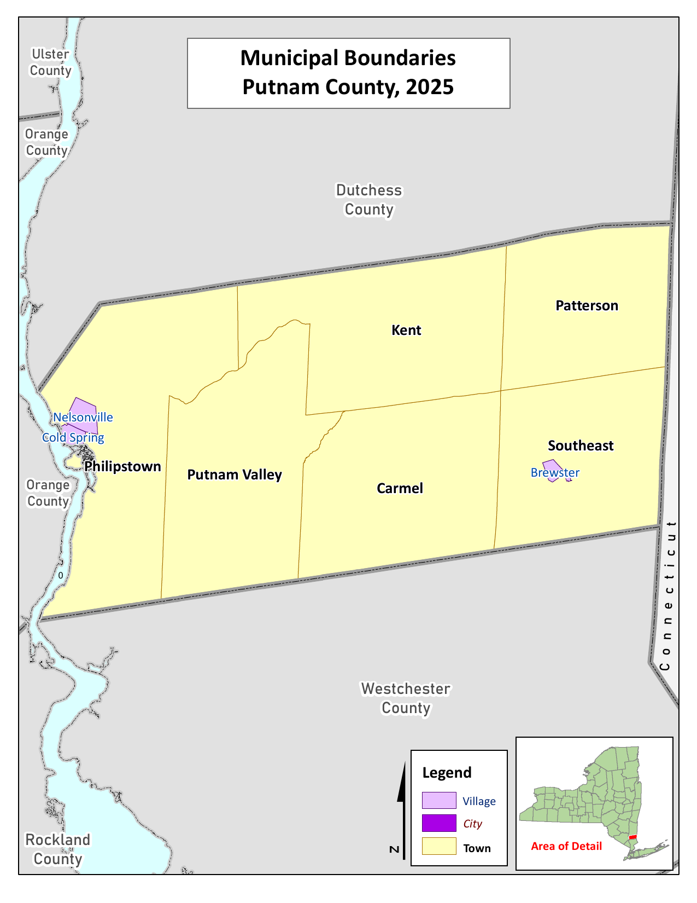
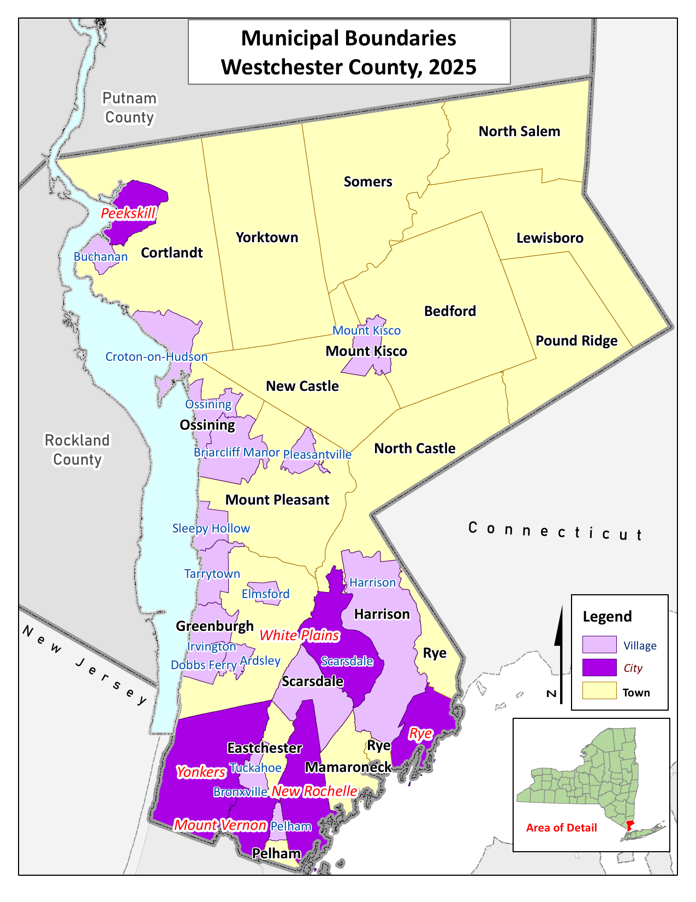
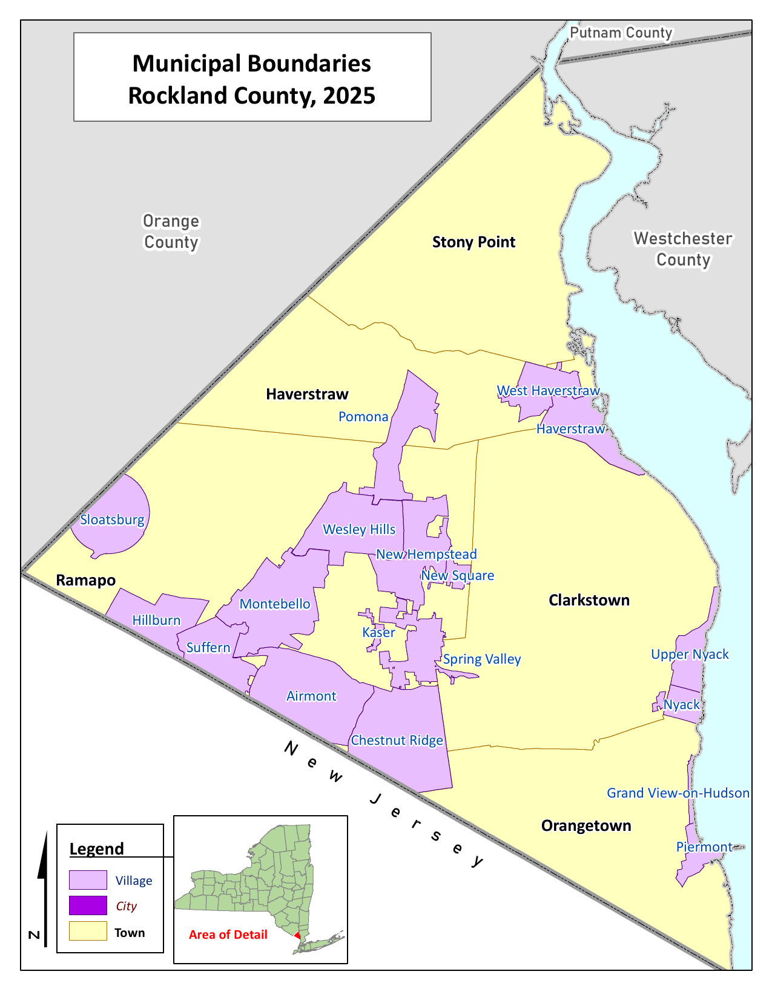
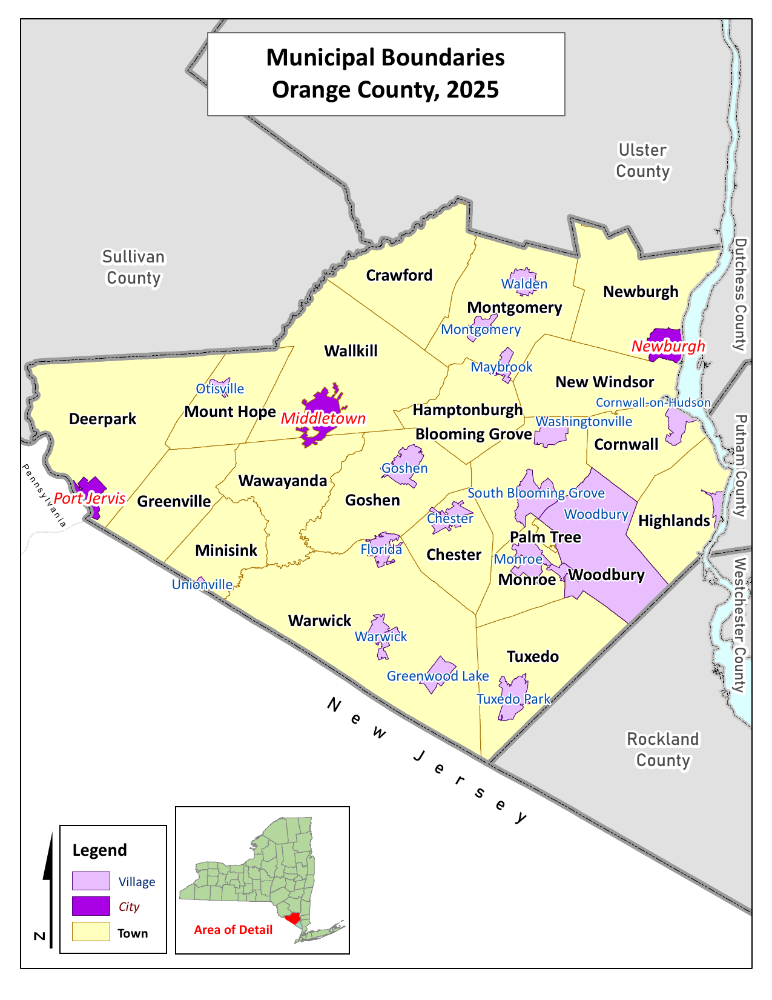
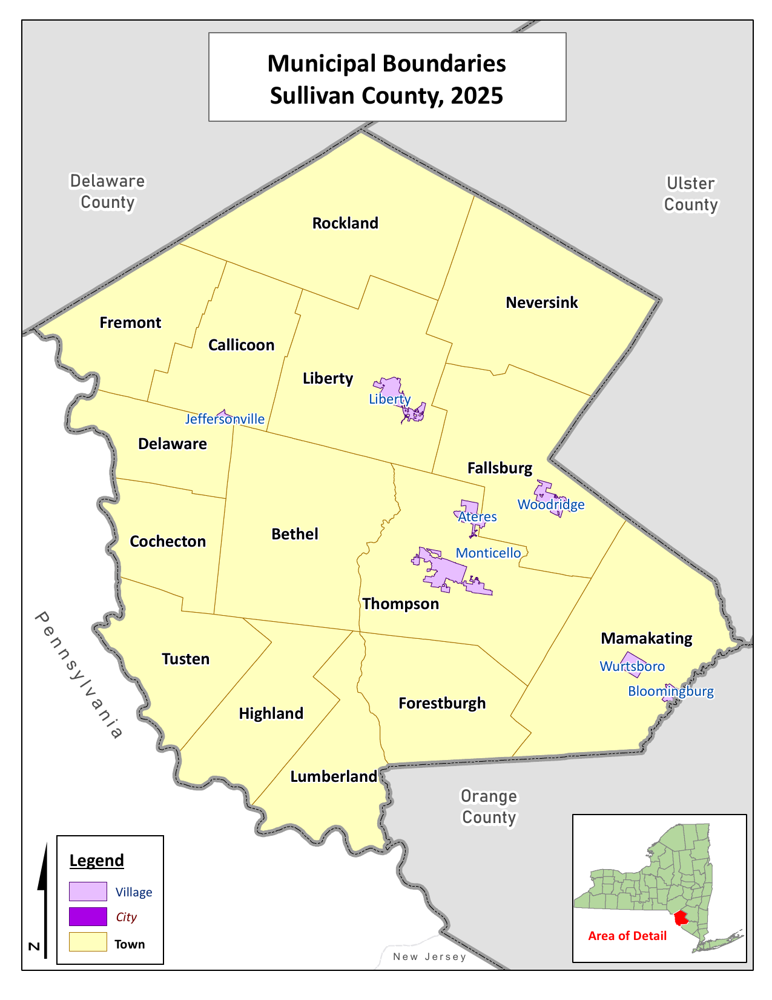
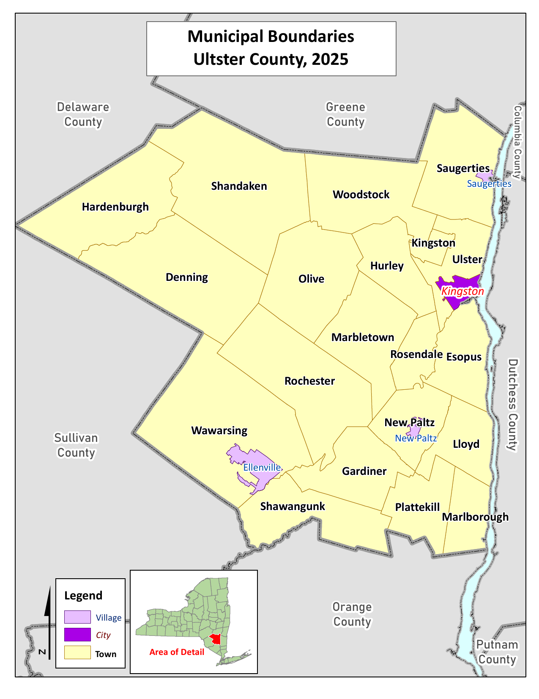

## Appendix A - Mid-Hudson Region Map

{#fig-appendix-a-mid-hudson-region-map fig-alt="Mid-Hudson Region map" width="100%"}
[Open full PDF](../pdfs/CHA%20Map/2025%20CHA%20County%20Municipality%20Maps_All_Part1.pdf)

## Appendix B - Dutchess County Map

{#fig-appendix-b-dutchess-county-map fig-alt="Dutchess County map" width="100%"}
[Open full PDF](../pdfs/CHA%20Map/2025%20CHA%20County%20Municipality%20Maps_All_Part2.pdf)

## Appendix C - Orange County Map

{#fig-appendix-c-orange-county-map fig-alt="Orange County map" width="100%"}
[Open full PDF](../pdfs/CHA%20Map/2025%20CHA%20County%20Municipality%20Maps_All_Part3.pdf)

## Appendix D - Putnam County Map

{#fig-appendix-d-putnam-county-map fig-alt="Putnam County map" width="100%"}
[Open full PDF](../pdfs/CHA%20Map/2025%20CHA%20County%20Municipality%20Maps_All_Part4.pdf)

## Appendix E - Rockland County Map

{#fig-appendix-e-rockland-county-map fig-alt="Rockland County map" width="100%"}
[Open full PDF](../pdfs/CHA%20Map/2025%20CHA%20County%20Municipality%20Maps_All_Part5.pdf)

## Appendix F - Sullivan County Map

{#fig-appendix-f-sullivan-county-map fig-alt="Sullivan County map" width="100%"}
[Open full PDF](../pdfs/CHA%20Map/2025%20CHA%20County%20Municipality%20Maps_All_Part6.pdf)

## Appendix G - Ulster County Map

{#fig-appendix-g-ulster-county-map fig-alt="Ulster County map" width="100%"}
[Open full PDF](../pdfs/CHA%20Map/2025%20CHA%20County%20Municipality%20Maps_All_Part7.pdf)

## Appendix H - Westchester County Map

{#fig-appendix-h-westchester-county-map fig-alt="Westchester County map" width="100%"}
[Open full PDF](../pdfs/CHA%20Map/2025%20CHA%20County%20Municipality%20Maps_All_Part8.pdf)

## Appendix I - Mid-Hudson Region Community Partner Survey

[Mid-Hudson Region Community Partner Survey](../media/appendix-docs/I%20-%20Community%20Provider%20Survey%202025.pdf)

## Appendix J - Mid-Hudson Region Community Partner Survey References

[Mid-Hudson Region Community Partner Survey References](../media/appendix-docs/Mid-Hudson%20Region%20Community%20Partner%20Survey%20References.pdf)

## Appendix K - Putnam County and Nuvance CBO and Partner Survey

[Putnam County and Nuvance CBO and Partner Survey](../media/appendix-docs/K%20-%20Putnam%20CBO%20Survey_English_FINAL.pdf)

## Appendix L - Mid-Hudson Regional Community Health Survey

[Mid-Hudson Regional Community Health Survey](../media/appendix-docs/L%20-%20Dutchess%20and%20Putnam%20HVHealth0325_FinalQnaire.pdf)

## Appendix M - Orange County Community Health Survey

[Orange County Community Health Survey](../media/appendix-docs/M%20-%202024%20Script%20%280524OCHealthWeb_Prn%29.pdf)

## Appendix N - Orange County Community Asset Survey

[Orange County Community Asset Survey](../media/appendix-docs/N%20-%20Community%20Asset%20Survey%20ENG.pdf)

## Appendix O - Putnam County and Nuvance Community Health Experience Survey

[Putnam County and Nuvance Community Health Experience Survey](../media/appendix-docs/O%20-%20Putnam%20Community%20Health%20Experience%20Survey_English.pdf)

## Appendix P - Rockland County Community Health Assessment Survey

[Rockland County Community Health Assessment Survey](../media/appendix-docs/P%20-%20Rockland%20Community%20Health%20Assessment%20Survey_English%20Paper%20Version.pdf)

## Appendix Q - Greater New York Hospital Association 2025 Community Health Needs Assessment Survey

[Greater New York Hospital Association 2025 Community Health Needs Assessment Survey](../media/appendix-docs/Q%20-%202025%20CHNA%20Collab%20Survey_English.pdf)