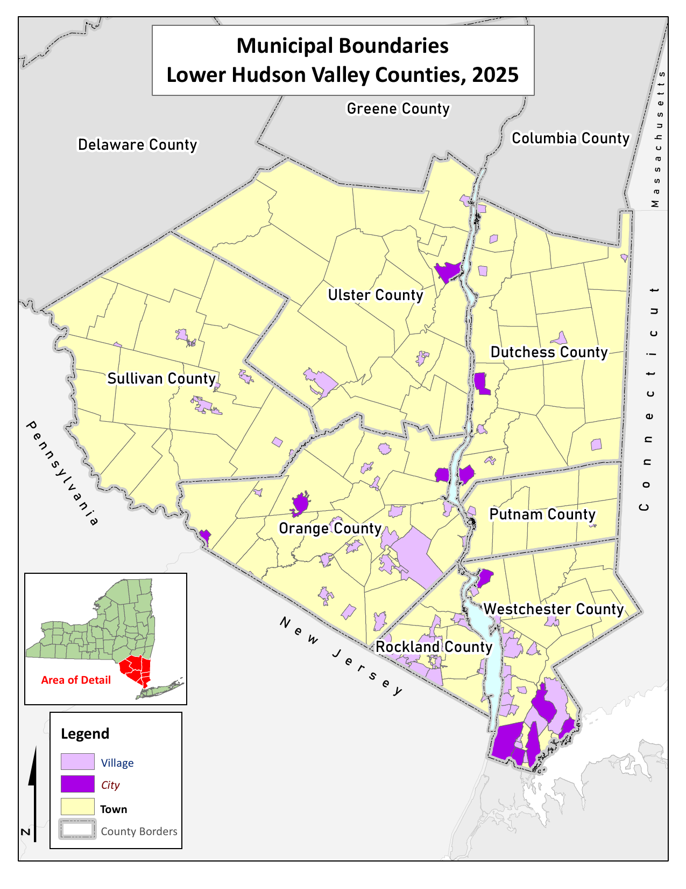
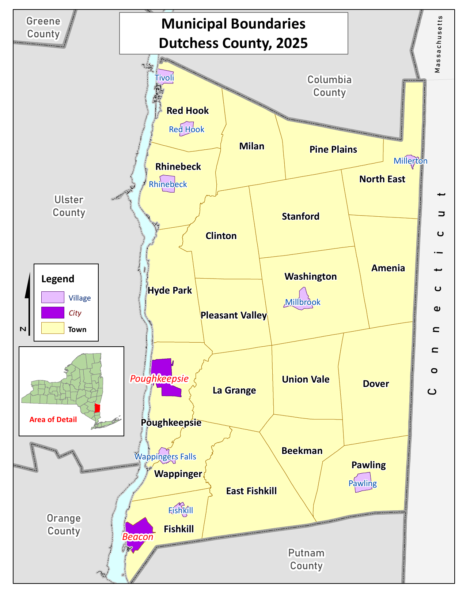
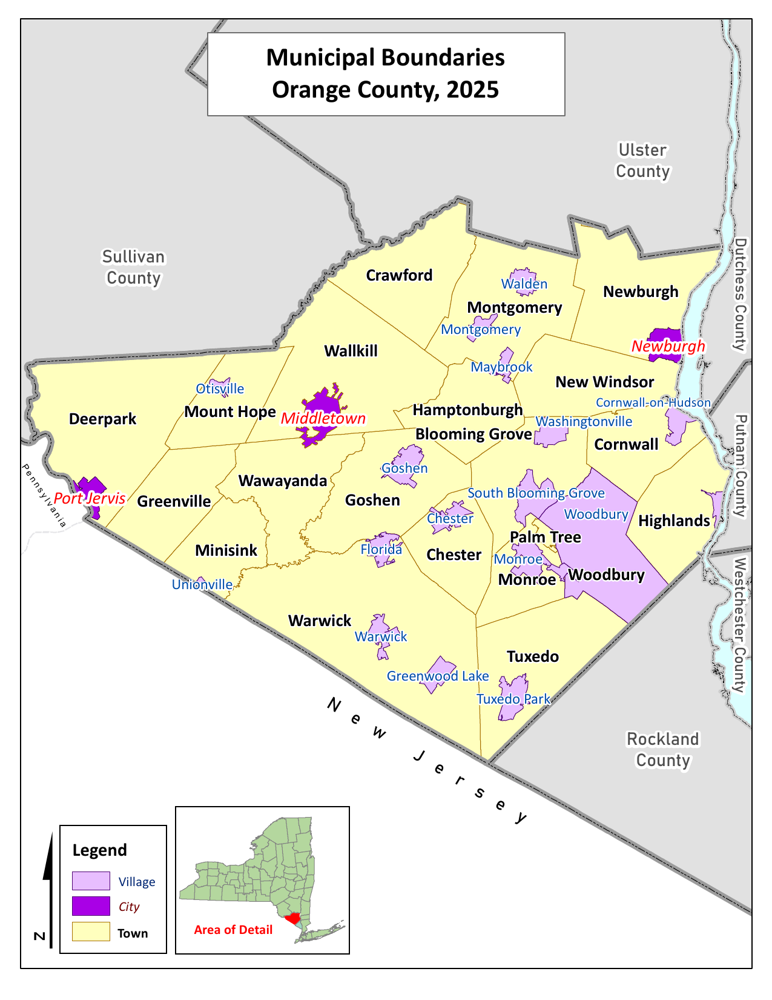
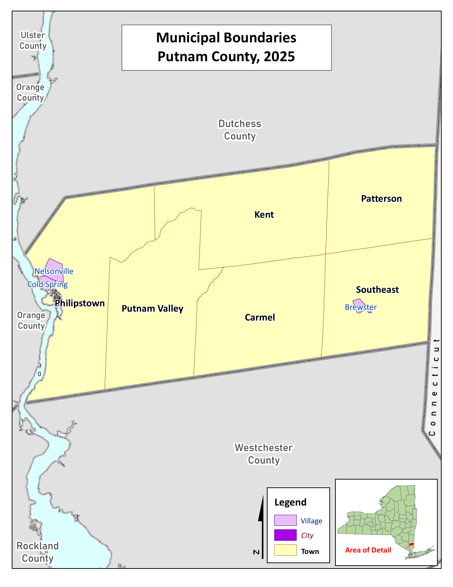
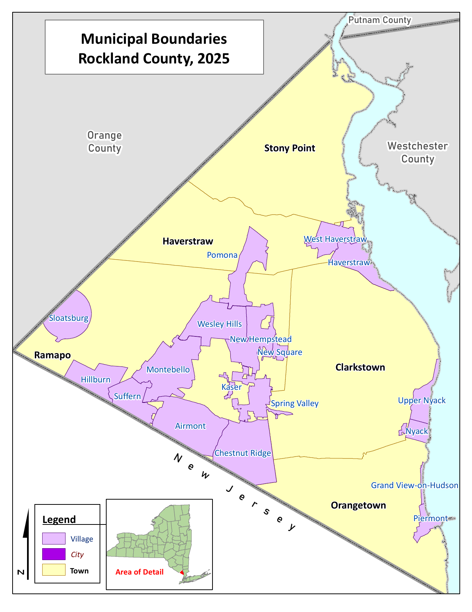
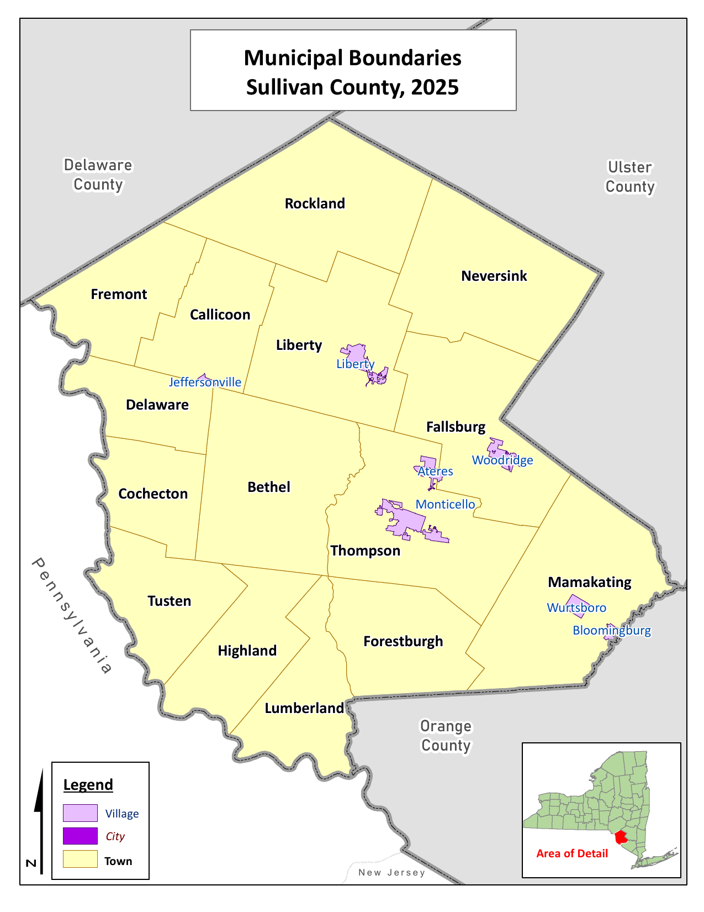
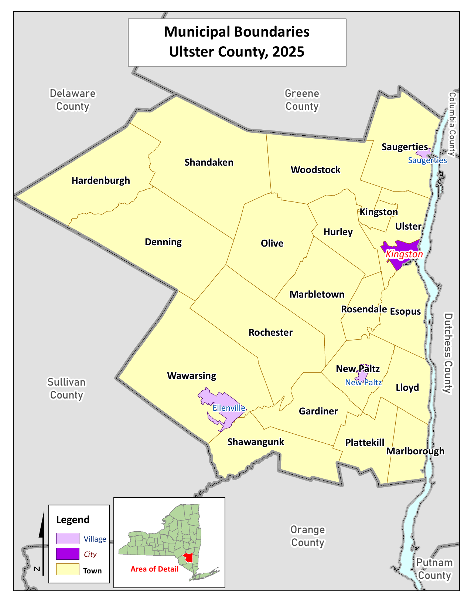
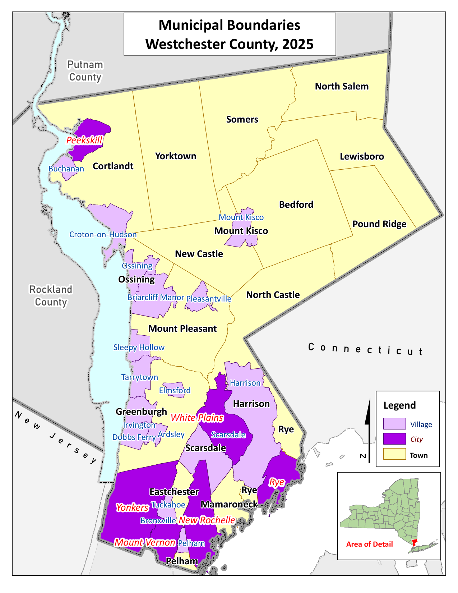

## Appendix A - Mid-Hudson Region Map {#sec-appendix-a-map}

{fig-alt="Mid-Hudson Region map" width="100%"}

[Open full PDF](../pdfs/CHA%20Map/2025%20CHA%20County%20Municipality%20Maps_All_Part1.pdf)

## Appendix B - Dutchess County Map {#sec-appendix-b-map}

{fig-alt="Dutchess County map" width="100%"}

[Open full PDF](../pdfs/CHA%20Map/2025%20CHA%20County%20Municipality%20Maps_All_Part2.pdf)

## Appendix C - Orange County Map {#sec-appendix-c-map}

{fig-alt="Orange County map" width="100%"}

[Open full PDF](../pdfs/CHA%20Map/2025%20CHA%20County%20Municipality%20Maps_All_Part6.pdf)

## Appendix D - Putnam County Map {#sec-appendix-d-map}

{fig-alt="Putnam County map" width="100%"}

[Open full PDF](../pdfs/CHA%20Map/2025%20CHA%20County%20Municipality%20Maps_All_Part3.pdf)

## Appendix E - Rockland County Map {#sec-appendix-e-map}

{fig-alt="Rockland County map" width="100%"}

[Open full PDF](../pdfs/CHA%20Map/2025%20CHA%20County%20Municipality%20Maps_All_Part5.pdf)

## Appendix F - Sullivan County Map {#sec-appendix-f-map}

{fig-alt="Sullivan County map" width="100%"}

[Open full PDF](../pdfs/CHA%20Map/2025%20CHA%20County%20Municipality%20Maps_All_Part7.pdf)

## Appendix G - Ulster County Map {#sec-appendix-g-map}

{fig-alt="Ulster County map" width="100%"}

[Open full PDF](../pdfs/CHA%20Map/2025%20CHA%20County%20Municipality%20Maps_All_Part8.pdf)

## Appendix H - Westchester County Map {#sec-appendix-h-map}

{fig-alt="Westchester County map" width="100%"}

[Open full PDF](../pdfs/CHA%20Map/2025%20CHA%20County%20Municipality%20Maps_All_Part4.pdf)

## Appendix I - Mid-Hudson Region Community Partner Survey {#sec-appendix-i-community-partner-survey}

[Click to view: Mid-Hudson Region Community Partner Survey](<../media/appendix-docs/I - Community Provider Survey 2025.pdf>)

## Appendix J - Mid-Hudson Region Community Partner Survey References {#sec-appendix-j-community-partner-survey-references}

[Click to view: Mid-Hudson Region Community Partner Survey References](<../media/appendix-docs/Mid-Hudson Region Community Partner Survey References.pdf>)

## Appendix K - Putnam County and Nuvance CBO and Partner Survey {#sec-appendix-k-putnam-nuvance-cbo-survey}

[Click to view: Putnam County and Nuvance CBO and Partner Survey](<../media/appendix-docs/K - Putnam CBO Survey_English_FINAL.pdf>)

## Appendix L - Mid-Hudson Regional Community Health Survey {#sec-appendix-l-mid-hudson-regional-community-health-survey}

[Click to view: Mid-Hudson Regional Community Health Survey](<../media/appendix-docs/L - Dutchess and Putnam HVHealth0325_FinalQnaire.pdf>)

## Appendix M - Orange County Community Health Survey {#sec-appendix-m-orange-county-community-health-survey}

[Click to view: Orange County Community Health Survey](<../media/appendix-docs/M - 2024 Script (0524OCHealthWeb_Prn).pdf>)

## Appendix N - Orange County Community Asset Survey {#sec-appendix-n-orange-county-community-asset-survey}

[Click to view: Orange County Community Asset Survey](<../media/appendix-docs/N - Community Asset Survey ENG.pdf>)

## Appendix O - Putnam County and Nuvance Community Health Experience Survey {#sec-appendix-o-putnam-nuvance-community-health-experience-survey}

[Click to view: Putnam County and Nuvance Community Health Experience Survey](<../media/appendix-docs/O - Putnam Community Health Experience Survey_English.pdf>)

## Appendix P - Rockland County Community Health Assessment Survey {#sec-appendix-p-rockland-county-community-health-assessment-survey}

[Click to view: Rockland County Community Health Assessment Survey](<../media/appendix-docs/P - Rockland Community Health Assessment Survey_English Paper Version.pdf>)

## Appendix Q - Greater New York Hospital Association 2025 Community Health Needs Assessment Survey {#sec-appendix-q-gnyha-2025-community-health-needs-assessment-survey}

[Click to view: Greater New York Hospital Association 2025 Community Health Needs Assessment Survey](<../media/appendix-docs/Q - 2025 CHNA Collab Survey_English.pdf>)